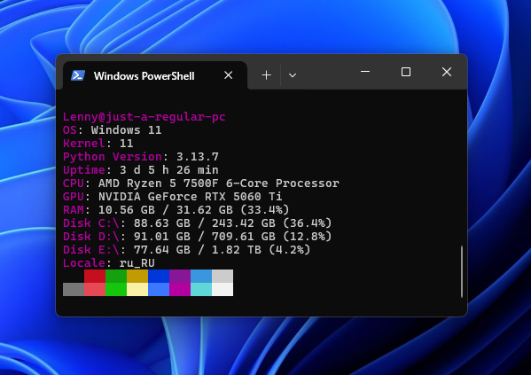

# yafetch


yet another fetch app, written in Python

## Installation
tested on Python 3.13+
```
git clone https://github.com/Lennichijou/yafetch.git
cd yafetch
pip install -r requirements.txt
python ./yafetch.py
```
inspired by other tools featured on awesome-fetch list
